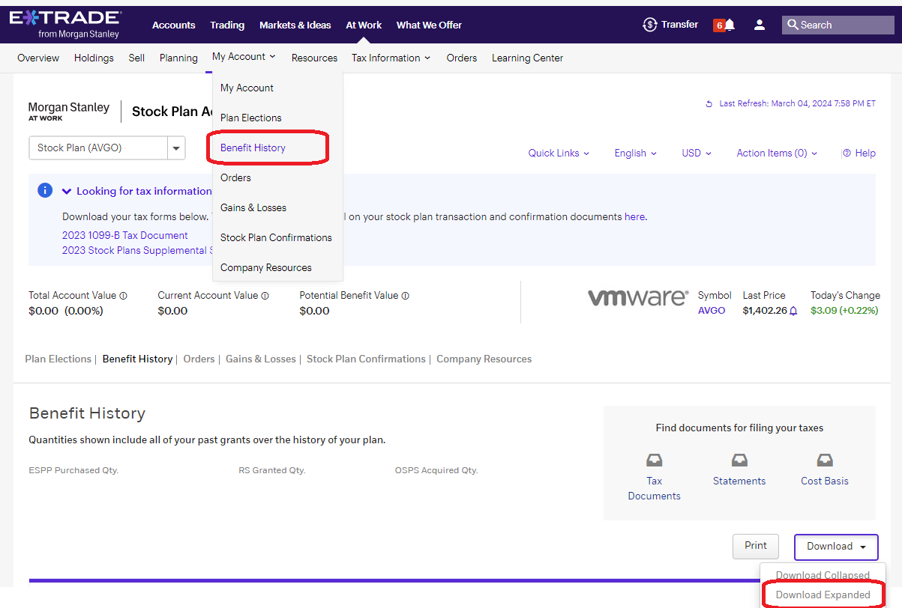

# Problems impacting holders of WMV through merger

There've been various issues and confusion around the Broadcom acquisition of VMware. This page collates the most common issues, identifies impacted groups, and details the impact and any known remediations.

## $0 cost basis on 1099-B and incorrect adjustment in Supplement

The 1099-B and Supplement both have a cost basis of $0 for all lots Stock Plan lots.
While this is technically correct for RSUs, as you did not pay anything for them, your _tax basis_ is the Fair Market Value at time of vest as you paid taxes on the RSUs at that time.

The primary issue here isn't the basis info in the 1099-B - it's the lack of correct info in the Supplement. I found [this](https://investor.vanguard.com/investor-resources-education/taxes/cost-basis-covered-noncovered#:~:text=In%20addition%2C%20for,and%20Form%208949.) on Vanguards site noting they aren't required to make certain adjustment, and for them they don't for cross-account wash sales, or for gift tax.

We're suffering from an _expectation_ mismatch with what eTrade are obligated to and what we need from them, and it's exposed a potential complication to filing we were unaware of. This should feed into decisions of what brokers to use, but I don't _think_ there's an actual lapse of duty. I do think providing a supplement with incorrect numbers is leading holders into error as there's no point in the supplement if the numbers cannot be used in Frm 8949.

The adjustment present in my eTrade Supplement is the original cost basis of VMW, but a tax basis must account for the Return of Captial from the Dell distributions:

* 2018-12-27 - reduce basis by $10.18 per share of VMW
* 2021-10-29 - reduce basis by $16.87 per share of VMW

Groups:

* eTrade Stock Plan account holdings AND
* holding VMW since before 2021-10-29

Impact:

* all cash proceeds recognized as gain without unless reporting an adjustment on Form 8949
* use of Supplement values as adjustment will overstate cost basis resulting in underpayment of tax
* lots of frustration and confusion around how to get a correct Form 8949 or the inputs to such

## Incorrect code ‘N’ in Form 8949 generated by TurboTax

TurboTax is adding code `N` in column (f) which is described as:

> You received a Form 1099-B or 1099-S (or substitute statement) as a nominee for the actual owner of the property and Report the transaction on Form 8949 as you would if you were the actual owner …

TurboTax [acknowledged the issue](https://ttlc.intuit.com/community/taxes/discussion/form-8949-column-f-code-n/00/3199783).

Groups:

* TurboTax users who auto-imported their Etrade 1099-B

Impact:

* incorrect Form 8949 - need to delete and re-enter values manually

Mitigation:

* delete the prior sales rows and rerun the import. I don't know when this was fixed but it was functional on 2024-03-03 for me.

## Treatment of proceeds as dividend

The cash proceeds from the merger were treated as a dividend instead of “[cash to boot](https://www.costbasis.com/stkchanges/cashtoboot.html#:~:text=Sometimes%20a%20corporation%20goes%20through,addition%20to%20the%20new%20stock.)”.

Groups:

* non-resident aliens - if you file a [W-8 BEN](https://www.irs.gov/forms-pubs/about-form-w-8-ben) with the US, this is you
  * ? was this specific to eTrade or did other brokers do the same?

Impact:

* (tentative) cash proceeds were taxed as dividend rather than capital gain
* (tentative) difficulty reclaiming withheld taxes from IRS
* (tentative) no deferral of taxes though application of tax basis

## Fractional share sold at incorrect price

Any fractional share of AVGO after the merger and conversion was sold per the terms in Form 8937, which specified a price of $979.50 (FMV at time of merger).
eTrade sold these fractions multiple days after at $904.79.

Groups:

* eTrade account holders

Impact:

* a tiny loss - the maximum possible loss is if you had 0.999 of a share (rounding seems to be to 3dp), equaling $75.61

## E-trade Stock Plan Confirmations does not have the confirmations

One person has reported (and reported that eTrade have said it's affecting multiple people) that they have do not have confirmations documents as detailed in [Usage doc](usage.md#etrade-stock-plan-confirmations).

Groups:

* some eTrade account holders - specific criteria unknown

Impact:

* no confirmation PDFs available for extracting lot share quantity and basis information
* `NOT ON FILE` shows up in the 1099-B for `Cost or other Basis`

Mitigation:

* Download the BenefitHistory.xlsx as shown below and extract that data from there

## 1099-B has only totals and no lot information

Some people are reporting that their 1099-B does not have a line per lot, only section totals for Long/Short Covered/Non-covered securities.

Groups:

* some eTrade account holders - specific criteria unknown

Impact:

* unable to import lots into TurboTax or other preparation software

Mitigation:

* Download BenefitHistory.xlsx as shown for missing confirmations and look for lot level information in there
* If not, contact eTrade customer support to ask for a remediation.

## Estimated value used for 2021 return of capital without a corrected 1099 being issued

Multiple people have confirmed through statements that the value used for the 2021 return of capital was the estimated `$16.58` value found in the [draft form](documents/Form%208937%20-%20October%2029,%202021.pdf) rather than the `$16.87` value from the [final form](documents/IRS%20Form%208937%20-%20VMWARE,%20INC.%20November%201,%202021%20Distribution.pdf). No corrected 1099 was issued to anyone who has confirmed for me.

Groups:

* eTrade account holders with shares from prior to the Dell distribution on 2021-10-29.
  * The non-taxable deposit amount, found on Oct 2021's eTrade statement, should be a very close multiple of the number of VMW shares held on that date.

Impact:

* if the official value is used for basis adjustment, then basis will be too low by `$0.29` per VMW share.

Mitigation:

* use the actual non-taxable return amount as the basis adjustment (this seems technically valid in terms consistency, but I don't know if it's legally permitted), or
* request a corrected 1099 from eTrade and file an amended tax return for 2021 using the corrected values

## Etrade reports some (or all) ESPP lots under "Long term non-covered" in 1099-B

At least two people have noted that they have ESPP lots that are reported as Noncovered Securities in their 2023 1099-Bs. See [#105](https://github.com/hickeng/financial/issues/105).

Groups:

* some eTrade account holders with ESPP shares - specific criteria unknown

Impact:

* technically incorrect data filed with IRS - consequence unknown

Mitigations:

* Request a corrected 1099 from eTrade
* Change the `Sales Section` for the entry in TurboTax, et al, that imported the form to the correct value (Long Term, (covered))
  * I _hope_ it's allowed to change the Sales Section like this but cannot confirm. If we're not supposed to change it, why would it be a dropdown...?
  * See [#105](https://github.com/hickeng/financial/issues/105) for currnent state of discussion on additional steps and details.
