# Sheet User Instructions

User documentation for the worksheet. This aims to be a hand-held step-by-step for how to gather the necessary documents, extract the information from them, and add it into the worksheet, chose any optional values, and then understand the result.

For how to access the worksheet, see [the readme install section](https://github.com/hickeng/financial?tab=readme-ov-file#install)

# Inputs

This section is about getting all of the input data needed. Once gathered, you should back this up and keep it in case of future reference.

## Gathering documents from eTrade

There's various documents we need to export from eTrade.

### eTrade Stock Plan Confirmations

Gather the ESPP purchase confirmation, and RSU release confirmation documents for every lot for which you still own any shares from [the trade confirmations page](https://us.etrade.com/etx/sp/stockplan#/myAccount/stockPlanConfirmations). I don't know a better way than selecting each year in turn and clicking on the download links. If anyone finds a way to batch this, please let me know.

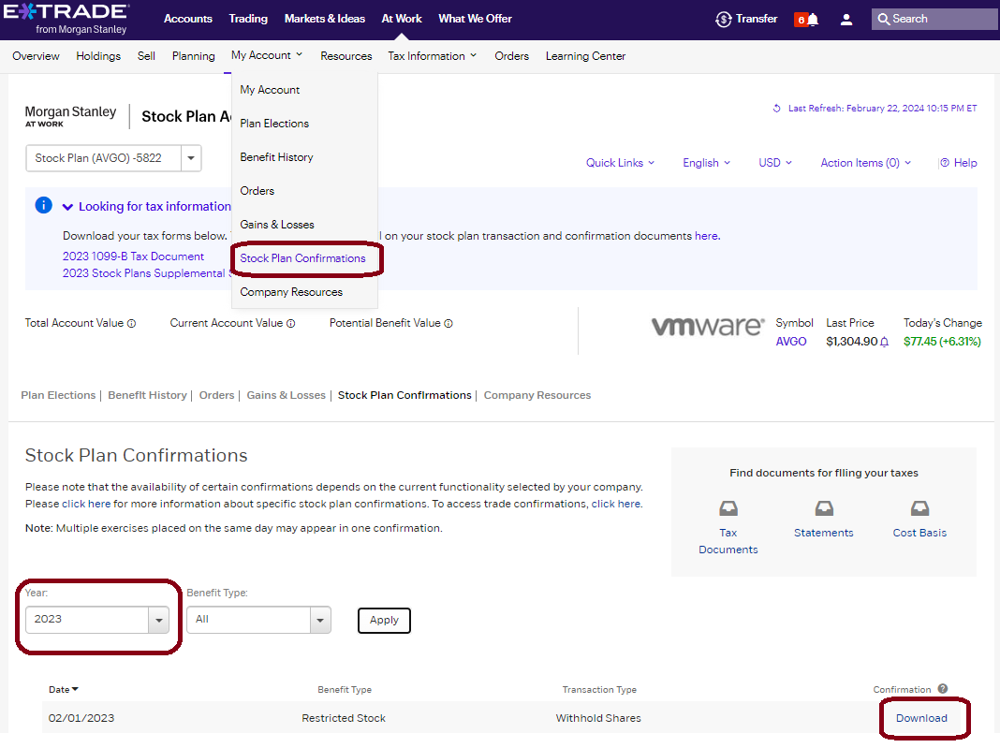

Keep these for your records and back them up somewhere. They are THE definitive input into the entire process. Everything else can be reconstructed if you have these.

If you sold AVGO post-merger in 2023, you'll likely need to use the tradesdownload.csv to populate the worksheet `Share amounts from eTrade` column

### eTrade total VMW share ownership

We want the total number of shares you owned over the merger as a validation input. You may already have this value from elsewhere, but if not you can get it through [`Stock Plan->My Account->Gains & Losses`](https://us.etrade.com/etx/sp/stockplan#/myAccount/gainsLosses).

Filter the view to show all VMW shares held on the date of the merger, and remember to hit apply. The total, circuled in brown, should be a whole number.

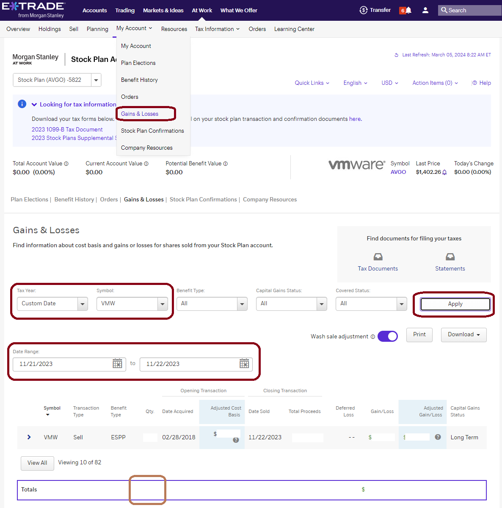


### eTrade transaction log

Use [the eTrade transaction log](https://us.etrade.com/e/t/accounts/txnhistory) (filter for entries relating to acquisition, propably between 2023-11-21 and 2023-12-09) to retrieve the following. You can also download a CSV using the tiny download icon in the top right:
* VMW shares converted to AVGO (green)
* VMW shares exchanged for cash (blue)
* total cash consideration recieved (dark red)
* total AVGO received (red)
* fractional AVGO sale price (orange)

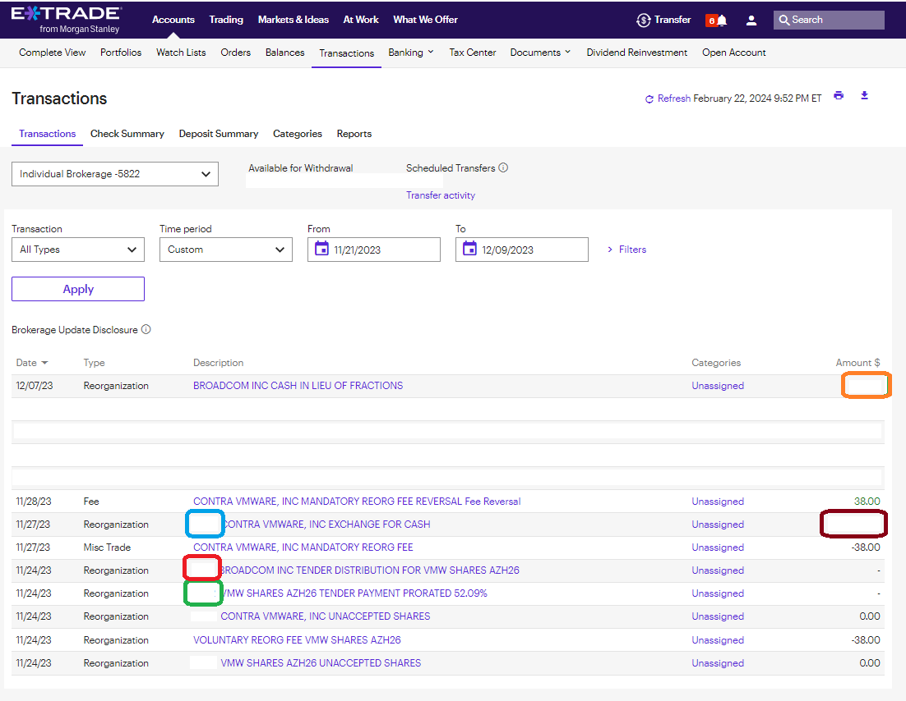


These values should be entered into the worksheet Input section on the `Summary` sheet. The VMW shares exchange for XXX are used to determine the specific conversion ratio that applied to you, which is used to calculate the per-lot quantities for cash and AVGO.

The other values are used for validation as, with just the ratio and the number of shares for each lot, we expect the numbers to match up. The `VMW held at close` is expected to be the sum of the shares converted to AVGO and the shares exchanged for cash. This value was retrieved [in an earlier step](#etrade-total-vmw-share-ownership).

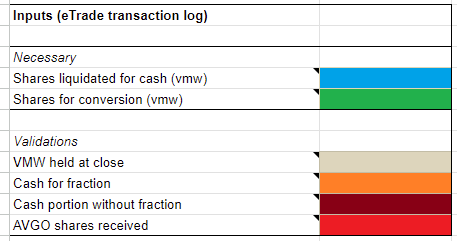


### eTrade Benefit History spreadsheet

Go to [`Stock Plan->My Account->Benefit History`](https://us.etrade.com/etx/sp/stockplan#/myAccount/benefitHistory) and download the spreadsheet.

The benefit history spreadsheet is the richest document I've found regarding having all the data in one place. However that also makes it rather opaque to use. Download it so you've got it for future reference and in case the approaches detailed in other sections runs into absent data issues.

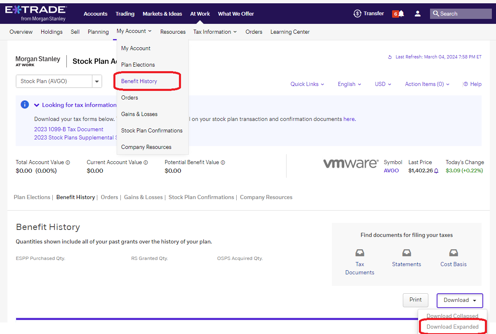


### eTrade per-lot AVGO quantities

Go to etrade [`Stock Plan->My Account->Benefit History`](https://us.etrade.com/etx/sp/stockplan#/myAccount/benefitHistory) and look at the `OSPS` section:
* for each lot, take the `Acquired Qty.` (orange) and add it into the worksheet (details below)
* the `Total Acquired Qty.` (red) should match the number of AVGO you received in the transaction log and entered into

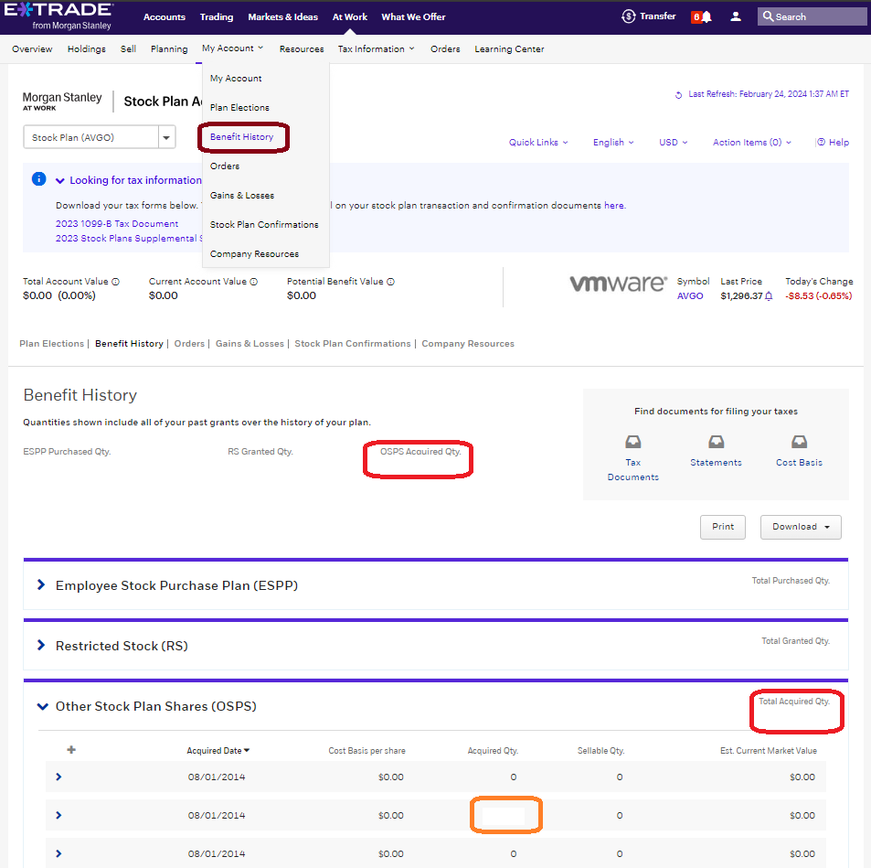

For each lot I see it bracketed with a pair of 0 qty lots. I _presume_ these come from the various holding company transitions that occurred as part of the conversion from `VMW->Holding1->Holding2->AVGO`... regardless I've ignored them.

Enter these received quantities into the `Share amounts from eTrade` column in ESPP and RSU sheets. Be sure to match them up to the appropriate row in the sheet if using the sheet to save these values using the `Purchase Date`.

If you had a fractional share, you'll be adjusting one of these values to add it back later, once the lot it came from has been determined.

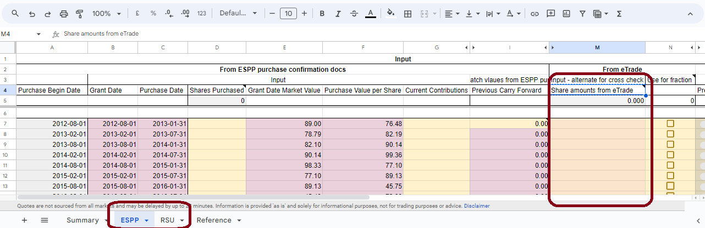


### eTrade 1099-B & Supplement

We need to get per-lot details from the eTrade 1099-B document for 2023. For completeness you'll want the Supplement and the CSV export of your trades for 2023 tax year. If you sold VMW pre-acquisition, or AVGO post-acquisition _I expect_ them to show up in the csv, but cannot confirm personally. Keep these for your records.

These documents can be found in the [eTrade Tax Center](https://us.etrade.com/etx/pxy/tax-center?resource=stock-plan).
<!--  -->
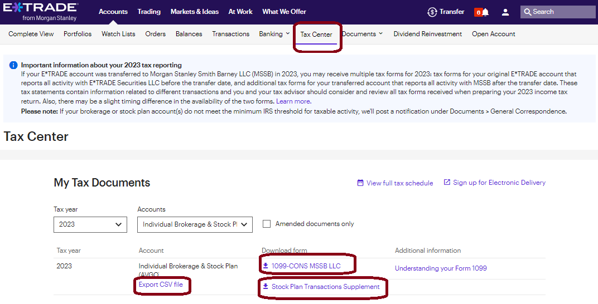


It will contain some summary information that we don't need. What we need is the per-lot details found in `PROCEEDS FROM BROKER AND BARTER EXCHANGE TRANSACTIONS`

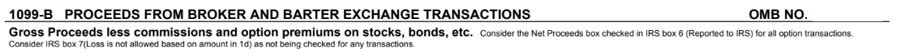

Within there, there may be multiple different subsections. We only care about these groupings because it makes it easier to figure out whether it's an ESPP or RSU lot:
* `Short Term - Noncovered Securities` - RSU from 2023
* `Long Term - Noncovered Securities` - RSU from pre-2023
* `Long Term - Covered Securities` - ESPP (the final ESPP lot was 2022 so they'll all be here)

Each of those sections has the following fields:

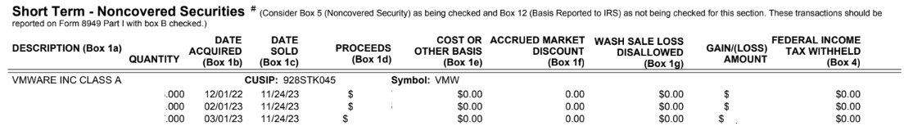

We're only interested in VMW shares and only lots held over the merger. So:
* `Description Box 1a` is `VMWARE INC CLASS A`
* `DATE SOLD (Box 1c)` is `11/24/23`

For these lots I expect all of the dollar value fields to be `$0.00` except for `PROCEEDS (Box 1d)` and `GAIN(LOSS) AMOUNT`. If you've got values in any other column you'll need to understand why. Upvote [this tracking issue](https://github.com/hickeng/financial/issues/57) to flag the fact you're in this situation and the community can help figure out what it means.

Eventually you'll need to enter (or I'll add import capabilities) the various values for each lot into the sheet so that we can double check the 1099-B vs the sheet contents. However for now the sheet presents Form8949 numbers based off the calculated values. As such the 1099-B is only for reference right now (as of v0.1.4).


## Summary Sheet Inputs

The Summary page has the following inputs:

### Necessary
These values are fundamental to the function of the sheet and _must_ be present and correct. They were obtained during gathering in [the eTrade transaction log](#etrade-transaction-log) step:
* Shares liquidated for cash (vmw) - blue
* Shares for conversion (vmw) - green

### Validations
These are used for cross-checking output of the sheet with reality and to avoid transcription errors:
* VMW held at close - should be the sum of the _Necessary Inputs_ shares. Collected [in this step](#etrade-total-vmw-share-ownership) - pale brown
* Cash for fraction - the dollar value you received for any fraction of AVGO after conversion. Collected [in this step](#etrade-transaction-log) - orange
* Cash portion without fraction - the dollar value you received from shares converted to cash, before the sale of the fraction. Collected [in this step](#etrade-transaction-log) (same as above) - dark red
* AVGO shares received - the number of AVGO shares you received, used to doublecheck the number calculated by the sheet. Collected [in this step](#etrade-transaction-log) (same as above) - red


### Tax Estimation
One purpose of the sheet was to allow estimation of 2023 tax liability so I could pay estimated taxes for the Janurary 15th deadline. The `Output/Merger` section in the Summary sheet has some useful information for this purpose, namely the Short and Long term captial gains realized in the merger.

However that's only useful as an input into actual taxes owed, so there's a more involved calculation added that outputs in the `Tax Impact` section.

NOTE: this is not a well tested and validated tax estimate and your actual taxes owed will be different to these numbers. The goal is to be _close enough_ to avoid underpayment penalties for the window between Jan 15th, and filing an extension with a refined estimate on Tax Day (April 15th). My estimate from the sheet was within 2% of that from TurboTax after feeding in the same info.


Safe harbor thresholds are:
* Federal - concrete number as it's based on 2022 taxes.
  * [General rule](https://www.irs.gov/publications/p505#en_US_2023_publink1000194576:~:text=paying%20a%20penalty.-,General%20rule,-.%20The%20total) (2022 AGI was less than `$150k` or `$75k` if married filing separately) - lesser of
    1. 90% of your total expected tax for 2023, or
    1. 100% of the total tax shown on your 2022 return. Your 2022 tax return must cover all 12 months.
  * [Higher income taxpayers](https://www.irs.gov/publications/p505#en_US_2023_publink1000194576:~:text=all%2012%20months.-,Special%20rules,-.%20There%20are)
    1. substitute 110% for 100% in (2) above
* California - likely to be a number based on 2023 taxes, so unknown without effort
    * the safe number to use is `90%` of 2023 taxes due - this covers everyone
    * [some people](https://www.ftb.ca.gov/pay/estimated-tax-payments.html) could use a lower threshold based on 2022 taxes

Another purpose of the sheet was to determine if it was worth pursuing the fact that eTrade did not honour Minimum Tax strategy or explicit lot selection when assigning cash/stock to lots. This is almost certainly more complexity than it's worth for many people. See [manual lot selection](#manual-lot-selection) for more detail, but in summary:
* it doesn't change the amount of tax you owe, only lets you defer some of that tax into the future
* it makes a substantive difference only if you have a large spread of tax basis or long/short treatment across the lots in your holding. If you've got plenty of ESPP and RSUs from 2020 onwards, or RSUs from pre-2020 it may be worth looking at.
* there's questions around the approach - see [#13](https://github.com/hickeng/financial/issues/13)

#### W2 and 1040

To get a useful estimate to feed into California taxes, enter the following additional information into the `Inputs (W2 & 1040)` section on the Summary sheet. This will allow an estimate of your progressive tax rate for Federal and California, along with the applicable Federal Long Term gains rate:

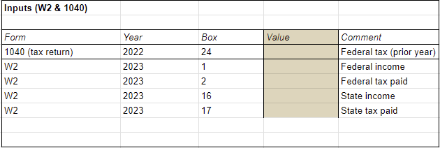

#### Estimated tax payments

If you've paid estimated taxes for Federal or State, enter them into the Tax Impact section - this is purely a convenience so that you can see what your unpaid tax liability is and whether you've met the safe harbor including estimated payments.

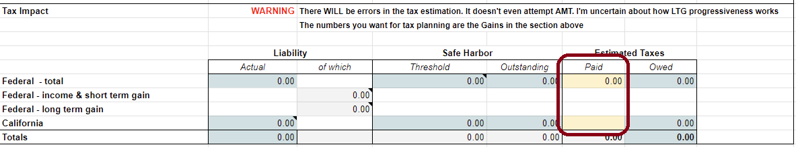

#### Other income

If you have substantial income outside of the merger and W2, then you can improve your estimate future using the [Other Income tweaks](#other-income).

#### Deduction and filing status

This is probably the roughest portion of the estimate. Filing status adjusts the Federal and California tax rate thresholds. Deduction applies to Federal but not California.

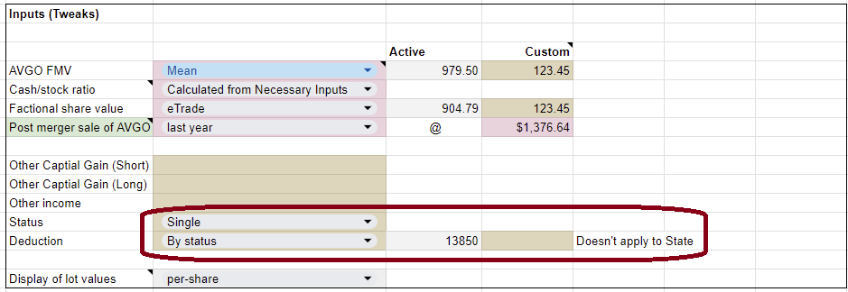

You can adjust your deduction manually if needed by selecting `Custom` and entering a value into the corresponding `Custom` field. Otherwise the deduction is hung off your selected filing status.


## ESPP

Pending: steps for mapping Purchase confirmations into ESPP datasheet


## RSU

Pending: steps for mapping Purchase confirmations into ESPP datasheet

Pending: steps for adding a vest date row that's not in the sheet


## Factional share

Pending: steps for determining which lot had the fractional share. This may be superceeded by enhancements to the sheet which could allow for automatic detection of the lot if the per-lot AVGO quantity from eTrade are provided.


# Outputs

This section walks through how to interpret the outputs from the sheet and what to do with them.

## Form 8949

Pending: [#53](https://github.com/hickeng/financial/issues/53)

## Merger details

### 2023 Captial Gain & Cash Consideration

### Future Captial Gain


# Estimated Tax


# Tweaks and Custom Functions

## Post merger sale of AVGO

This tweak allows you to change the presumed date of sale and price for post-merger AVGO shares. This is convenient for:
* experimenting with impact of waiting to sell for Short Term RSUs to graduate to Long Term
* experimenting with impact of waiting for disqualified ESPPs to qualify (all lots qualify since 2024-03-01)
* generating tax basis and imputed income for sales of AVGO in 2023 post-merger

Simply select the date at which you sold/will-sell AVGO and the price, and it'll adjust the green `Future` sections. The per-lot data needed for filing is in the RSU and ESPP datasheets on the far right. The dates in the dropdown correlate to the dates at which known RSU lots transition from Short Term to Long Term.

If you select `last year` then it'll also roll any income and capital gain/loss into the Summary sections for captial gain and estimated tax.

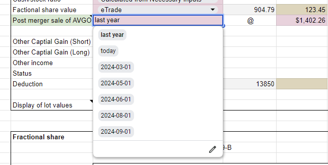

## Other income

To improve the tax estimation, add additional sources of income. These are rolled into your AGI estimate and impact the active Long Term Gains tax rate, and income tax rates for Federal and California.

I've found the easiest way to do this is with a multi-line `LET` statement as that allows for useful pretty names to be associated with values. You cannot easily edit these formulae directly in the sheet, so use Notepad, vi, etc and copy/paste.

Example:
```
=LET(
brokerOdiv,1234.56 + 7890.12,
brokerInt,0,
brokerProceeds,123456.78,
brokerProceedsBasis,23456.00,
brokerS199a,42.42,
etradeODiv,1812.00,
etradeInt,1111.11,
bankInt,2222.22,
fidelityOdiv,333.33,
fidelityInt,0,

brokerOdiv+brokerInt+brokerS199a+
brokerProceeds-brokerProceedsBasis+
etradeOdiv+etradeInt+
bankInt+
fidelityOdiv+fidelityInt
)
```

If Sheets complains about formula errors check the number of brackets and commas. If it complains about names, check for spelling between the name declaration and the use in the final section.

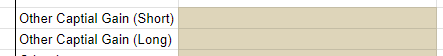

## Export

## Manual lot selection
