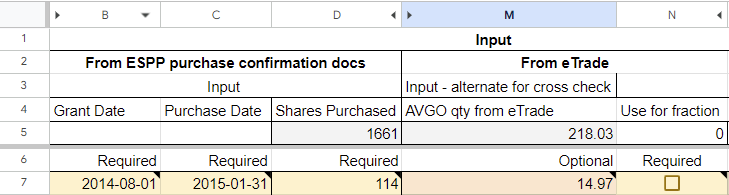
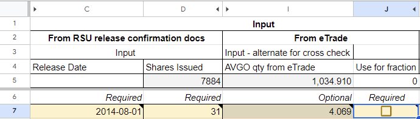
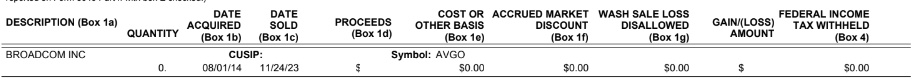
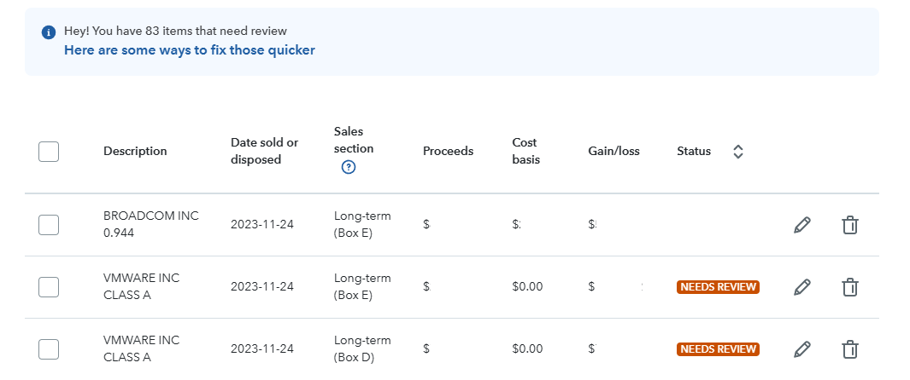

# Sheet User Instructions

User documentation for the worksheet. This aims to be a hand-held step-by-step for how to gather the necessary documents, extract the information from them, and add it into the worksheet, chose any optional values, and then understand the result.

For how to access the worksheet, see [the readme install section](https://github.com/hickeng/financial?tab=readme-ov-file#install)

# Inputs

This section is about getting all of the input data needed. Once gathered, you should back this up and keep it in case of future reference.

## Gathering documents from eTrade

There's various documents we need to export from eTrade.

### eTrade Stock Plan Confirmations

Gather the ESPP purchase confirmation, and RSU release confirmation documents for every lot where you held shares over the merger from [the trade confirmations page](https://us.etrade.com/etx/sp/stockplan#/myAccount/stockPlanConfirmations). If you have sold _some_ shares from a lot prior to the merger, you'll need to deduct that quantity from the `Shares Issued` or `Shares Purchased` values in the confirmation documents. We need the documents to determine the tax basis for a lot, but we only want to calculate tax for shares that you owned when the merger completed.

I don't know a better way than selecting each year in turn and clicking on the download links. If anyone finds a way to batch this, please let me know.


Keep these for your records and back them up somewhere. They are THE definitive input into the entire process. Everything else can be reconstructed if you have these.

If you sold AVGO post-merger in 2023, you'll likely need to use the tradesdownload.csv to populate the worksheet `Share amounts from eTrade` column

### eTrade total VMW share ownership

We want the total number of shares you owned over the merger as a validation input. You may already have this value from elsewhere, but if not you can get it through [`Stock Plan->My Account->Gains & Losses`](https://us.etrade.com/etx/sp/stockplan#/myAccount/gainsLosses).

Filter the view to show all VMW shares held on the date of the merger, and remember to hit apply. The total, circuled in brown, should be a whole number.


### eTrade transaction log

Use [the eTrade transaction log](https://us.etrade.com/e/t/accounts/txnhistory) (filter for entries relating to acquisition, propably between 2023-11-21 and 2023-12-09) to retrieve the following. You can also download a CSV using the tiny download icon in the top right:
* VMW shares converted to AVGO (green)
* VMW shares exchanged for cash (blue)
* total cash consideration recieved (dark red)
* total AVGO received (red)
* fractional AVGO sale price (orange)


These values should be entered into the worksheet Input section on the `Summary` sheet. The VMW shares exchange for XXX are used to determine the specific conversion ratio that applied to you, which is used to calculate the per-lot quantities for cash and AVGO.

The other values are used for validation as, with just the ratio and the number of shares for each lot, we expect the numbers to match up. The `VMW held at close` is expected to be the sum of the shares converted to AVGO and the shares exchanged for cash. This value was retrieved [in an earlier step](#etrade-total-vmw-share-ownership).


### eTrade Benefit History spreadsheet

Go to [`Stock Plan->My Account->Benefit History`](https://us.etrade.com/etx/sp/stockplan#/myAccount/benefitHistory) and download the spreadsheet.

The benefit history spreadsheet is the richest document I've found regarding having all the data in one place. However that also makes it rather opaque to use. Download it so you've got it for future reference and in case the approaches detailed in other sections runs into absent data issues.


### eTrade per-lot AVGO quantities

NOTE: if you do _not_ populate these values, then you _must not_ use the `Pro-rata - from eTrade share qty` option from `Cash/stock ratio` tweak as it depends on them.

Go to etrade [`Stock Plan->My Account->Benefit History`](https://us.etrade.com/etx/sp/stockplan#/myAccount/benefitHistory) and look at the `OSPS` section:
* for each lot, take the `Acquired Qty.` (orange) and add it into the worksheet (details below)
* the `Total Acquired Qty.` (red) should match the number of AVGO you received in the transaction log and entered into


For each lot I see it bracketed with a pair of 0 qty lots. I _presume_ these come from the various holding company transitions that occurred as part of the conversion from `VMW->Holding1->Holding2->AVGO`... regardless I've ignored them.

Enter these received quantities into the `Share amounts from eTrade` column in ESPP and RSU sheets. Be sure to match them up to the appropriate row in the sheet if using the sheet to save these values using the `Purchase Date`.

If you had a fractional share, you'll be adjusting one of these values to add it back later, once the lot it came from has been determined.


### eTrade 1099-B & Supplement

We need to get per-lot details from the eTrade 1099-B document for 2023. For completeness you'll want the Supplement and the CSV export of your trades for 2023 tax year. If you sold VMW pre-acquisition, or AVGO post-acquisition _I expect_ them to show up in the csv, but cannot confirm personally. Keep these for your records.

These documents can be found in the [eTrade Tax Center](https://us.etrade.com/etx/pxy/tax-center?resource=stock-plan).
<!--  -->


It will contain some summary information that we don't need. What we need is the per-lot details found in `PROCEEDS FROM BROKER AND BARTER EXCHANGE TRANSACTIONS`


Within there, there may be multiple different subsections. We only care about these groupings because it makes it easier to figure out whether it's an ESPP or RSU lot:
* `Short Term - Noncovered Securities` - RSU from 2023
* `Long Term - Noncovered Securities` - RSU from pre-2023
* `Long Term - Covered Securities` - ESPP (the final ESPP lot was 2022 so they'll all be here)

Each of those sections has the following fields:


We're only interested in VMW shares and only lots held over the merger. So:
* `Description Box 1a` is `VMWARE INC CLASS A`
* `DATE SOLD (Box 1c)` is `11/24/23`

For these lots I expect all of the dollar value fields to be `$0.00` except for `PROCEEDS (Box 1d)` and `GAIN(LOSS) AMOUNT`. If you've got values in any other column you'll need to understand why. Upvote [this tracking issue](https://github.com/hickeng/financial/issues/57) to flag the fact you're in this situation and the community can help figure out what it means.

Eventually you'll need to enter (or I'll add import capabilities) the various values for each lot into the sheet so that we can double check the 1099-B vs the sheet contents. However for now the sheet presents Form8949 numbers based off the calculated values. As such the 1099-B is only for reference right now (as of v0.1.4).


## Summary Sheet Inputs

The Summary page has the following inputs:

### Necessary
These values are fundamental to the function of the sheet and _must_ be present and correct. They were obtained during gathering in [the eTrade transaction log](#etrade-transaction-log) step:
* Shares liquidated for cash (vmw) - blue
* Shares for conversion (vmw) - green

### Validations
These are used for cross-checking output of the sheet with reality and to avoid transcription errors:
* VMW held at close - should be the sum of the _Necessary Inputs_ shares. Collected [in this step](#etrade-total-vmw-share-ownership) - pale brown
* Cash for fraction - the dollar value you received for any fraction of AVGO after conversion. Collected [in this step](#etrade-transaction-log) - orange
* Cash portion without fraction - the dollar value you received from shares converted to cash, before the sale of the fraction. Collected [in this step](#etrade-transaction-log) (same as above) - dark red
* AVGO shares received - the number of AVGO shares you received, used to doublecheck the number calculated by the sheet. Collected [in this step](#etrade-transaction-log) (same as above) - red


### Tax Estimation
One purpose of the sheet was to allow estimation of 2023 tax liability so I could pay estimated taxes for the Janurary 15th deadline. The `Output/Merger` section in the Summary sheet has some useful information for this purpose, namely the Short and Long term captial gains realized in the merger.

However that's only useful as an input into actual taxes owed, so there's a more involved calculation added that outputs in the `Tax Impact` section.

NOTE: this is not a well tested and validated tax estimate and your actual taxes owed will be different to these numbers. The goal is to be _close enough_ to avoid underpayment penalties for the window between Jan 15th, and filing an extension with a refined estimate on Tax Day (April 15th). My estimate from the sheet was within 2% of that from TurboTax after feeding in the same info.


Safe harbor thresholds are:
* Federal - concrete number as it's based on 2022 taxes.
  * [General rule](https://www.irs.gov/publications/p505#en_US_2023_publink1000194576:~:text=paying%20a%20penalty.-,General%20rule,-.%20The%20total) (2022 AGI was less than `$150k` or `$75k` if married filing separately) - lesser of
    1. 90% of your total expected tax for 2023, or
    1. 100% of the total tax shown on your 2022 return. Your 2022 tax return must cover all 12 months.
  * [Higher income taxpayers](https://www.irs.gov/publications/p505#en_US_2023_publink1000194576:~:text=all%2012%20months.-,Special%20rules,-.%20There%20are)
    1. substitute 110% for 100% in (2) above
* California - likely to be a number based on 2023 taxes, so unknown without effort
    * the safe number to use is `90%` of 2023 taxes due - this covers everyone
    * [some people](https://www.ftb.ca.gov/pay/estimated-tax-payments.html) could use a lower threshold based on 2022 taxes

Another purpose of the sheet was to determine if it was worth pursuing the fact that eTrade did not honour Minimum Tax strategy or explicit lot selection when assigning cash/stock to lots. This is almost certainly more complexity than it's worth for many people. See [manual lot selection](#manual-lot-selection) for more detail, but in summary:
* it doesn't change the amount of tax you owe, only lets you defer some of that tax into the future
* it makes a substantive difference only if you have a large spread of tax basis or long/short treatment across the lots in your holding. If you've got plenty of ESPP and RSUs from 2020 onwards, or RSUs from pre-2020 it may be worth looking at.
* there's questions around the approach - see [#13](https://github.com/hickeng/financial/issues/13)

#### W2 and 1040

To get a useful estimate to feed into California taxes, enter the following additional information into the `Inputs (W2 & 1040)` section on the Summary sheet. This will allow an estimate of your progressive tax rate for Federal and California, along with the applicable Federal Long Term gains rate:


#### Estimated tax payments

If you've paid estimated taxes for Federal or State, enter them into the Tax Impact section - this is purely a convenience so that you can see what your unpaid tax liability is and whether you've met the safe harbor including estimated payments.


#### Other income

If you have substantial income outside of the merger and W2, then you can improve your estimate future using the [Other Income tweaks](#other-income).

#### Deduction and filing status

This is probably the roughest portion of the estimate. Filing status adjusts the Federal and California tax rate thresholds. Deduction applies to Federal but not California.


You can adjust your deduction manually if needed by selecting `Custom` and entering a value into the corresponding `Custom` field. Otherwise the deduction is hung off your selected filing status.


## ESPP

Entry of ESPPs and RSUs into the sheet is a very structured process. For ESPPs this uses the Purchase confirmation documents.

In this document we care about only a few values:

1. Grant Date & Purchase Date - this pair of data controls the price at which the shares are purchased. You need to confirm _both_ are the same before using a row as some people have reported different grant dates resulting in very different purchase price. Match these up against the similarly titled columns in the `ESPP` sheet. If the prepopulated date values do not match yours, see [instructions for adding a row](#add-a-row-for-espp-or-rsus) and then add the data into the new row.
2. Enter the `Shares Purchased` and `Current Contributions` values from the document into the similarly named columns in the `ESPP` sheet.
3. Enter the `Previous Carry Forward` value from the document into the similarly named column. The sheet will calculate this value for all but the first, but double check and use the document value if different. You can put the value either in the top cell and let it propagate down, or put it in the row for your first lot. It depends whether you prefer to keep all inputs in the colour coded boxes or not, but there's no functional difference.




## RSU

Entry of ESPPs and RSUs into the sheet is a very structured process. For RSUs this uses the Release confirmation documents.

In this document we care about only a few values:

1. Release Date - this date dictates the price at which the shares are received. If the prepopulated date values do not match yours, see [instructions for adding a row](#add-a-row-for-espp-or-rsus) and then add the data into the new row.
2. Enter the `Shares Issued` and `Shares Traded` values from the document into the similarly named columns in the `RSU` sheet. `Shares Traded` is optional data simply to keep all non-derivable numbers in one place for future reference, but it has no bearing on calculations or taxes.
3. Double check the `Market Value Per Share` in the release confirmation matches the similarly named column in the sheet.




There are a couple of things to note about the RSU datasheet that do not apply to ESPP:

1. there are rows with duplicate values for `Release Date` and `Market Value Per Share`
2. there are rows where `Release Date` is tinted a slightly different colour

### Presence of Duplicate Values

 This is because vests from multiple awards can stack and be released on the same date. The presence of the multiple rows derives from the origin of this sheet as a way to estimate my Jan 15th bill - I entered the `Award Number` and `Award Date` into RSU columns A & B, which makes those duplicate rows distinct for me.

 I've not collpased them into a single row since because of the upgrade impact to people copy/pasting between versions of the sheet. You can safely leave duplicate rows that you do not need empty/populated with zeros, which will allow you to copy/paste into new versions easily.

 If you have multiple stacked vests I recommend you add them up into a single entry for clarity. If you need to track which award the share quantities came from, you can use a formula such as `=LET(awardA, 10, awardB, 20, awardA+awardB)` to preserve the source data while collpasing the numeric value.

### Tinted Release Dates

 This is the result of the single instance where I added rows in date order within the sheet. It caused substantial friction migrating input data between version `v0.1.0` and `v0.1.1`. The highlighting was added to help mitigate that mistake and show which rows were added. For people migrating from versions newer than `v0.1.0` the highlighting is irrelevant.

## Add a row for ESPP or RSUs

If you need a row for ESPP or RSU that isn't pre-populated with values, use the following approach to add it at the bottom of the relevant sheet. It's added at the bottom to make copy/paste into new sheet versions simpler and because there's no assumption of date ordering in the formulae.

1. Select the entire row just below the prepopulated values for the ESPP or RSU sheet by clicking on the row number (see example below).
2. Right click on the highlighted and select `Insert 1 row above` - done like this the `SUM` formulae automatically update to include the new row
3. Fill the formulae down into the new row
   1. Select the entire row _above_ the newly added row
   2. Scroll all the way to the right of the sheet and find the blue dot on the bottom right of the highlighted row
   3. Hover over the dot until the mouse cursor turns into a cross
   4. Click and drag down to include your newly added row, then release
   5. You should see the new row populate with default values


The blue dot to click and drag down:


## Factional share

There are several ways to determine the fractional lot. There is a problem if they don't result in the same answer! You need to know which lot the fraction was sold from because it's still sale of a share. That means you need to know the tax-basis in order to calculate gain, and if it's an ESPP lot (aka covered security) then you need to recognize ordinary income for the ESPP bargin element and adjust the tax-basis correspondingly. All of that is handled by the sheet, with a [possible minor future adjustment](https://github.com/hickeng/financial/issues/86) in our favour depending on CPA consult.


Once you have the lot, perform the following steps:

- [ ] check the tick box for the identified lot in the ESPP or RSU sheet
- [ ] add the fractional quantity back into the "AVGO qty from eTrade" cell for the lot (if you've chosen to populate those numbers). This is done so there's not this single special case value in a cell that's divergent from the others but not visually distinct, and also avoids additional formula complexity.
- [ ] TIP: Personally I add a note to the "AVGO qty from eTrade" cell for the fractional lot so that in the future I've got an in-situ reminder of why this single number differs from the downloaded docs, eg:
  > This is NOT the value in eTrade for this lot - it is the value in eTrade + the fractional share that was sold from this lot.
  > This is done to keep the rest of the sheet sane so there isn't a formula exception that applies to a single row.

Two options for determining the lot used for the fraction are below.

### Via 1099-B

If your 1099-B has granular entries for each lot sale (most people do, some people don't), you should see an entry similar to the example below. Note the `Description (Box 1a)` is `BROADCOM INC` where your others will be `VMWARE INC CLASS A`. From this line you want the `Date Acquired (Box 1b)`:



The sub-section of the 1099-B tells you which type of lot it came from:

* `Long Term - Noncovered securities` - RSU
* `Short Term - Noncovered securities` - RSU
* `Long Term - Covered Securities` - ESPP
* `Short Term - Covered Securities` - you should NOT have this section shares relevant to the merger as the final ESPP offering period close more than 1 year before the merger. Noted in the list for completeness.


### Via AVGO share quantities from eTrade

If you've filled in the optional "[AVGO qty from eTrade](#etrade-per-lot-avgo-quantities)" column, you should have one row with an anomolously low value in the "Derived from manual share qty" column. This column may be hidden - as of v0.1.5 it is `ESPP!U` and `RSU!Q`.
`Reference!E8` contains a threshold value based on the standard deviation of the "AVGO qty from eTrade" values - it's _likely_ you'll see a threshold value below that figure but not assured if your fractional share value is on the smaller end of the range (0 -> 1).


## AVGO qty from eTrade

These values were collected in [this section](#etrade-per-lot-avgo-quantities) which recommended entering them into the sheet as you collected them. If you did not do so enter these received quantities into the `Share amounts from eTrade` column in ESPP and RSU sheets. Be sure to match them up to the appropriate row in the sheet if using the sheet to save these values using the `Purchase Date`.


# Outputs

This section walks through how to interpret the outputs from the sheet and what to do with them.

## Form 8949

The values in the sheet are those needed to go into Form 8949 (although the `Code (f)` is currently missing). However most people will be using tax prep software, so are more likely to want to use those values to correct an imported 1099-B.


This example is for ESPP shares where the basis must be a negative value in the `Adjustment (g)` column. For RSUs the basis is instead a positive value in `1099-B basis (e)`. This difference is per IRS instructions on form usage. The `Proceeds (d`) are the true compensation you received for your VMW shares - the cash _plus_ the Fair Market Value of the AVGO. [costbasis.com](https://costbasis.com/calculators/cashtobootmerger.html#:~:text=you%20have%20two%20alternative%20ways%C2%A0to%20report%20this%20on%20your%20tax%20return) notes there are two approaches to declaring Proceeds to the IRS on your Form8949. The first is to report only the cash portion, report gain as mandated by Form8937 and set the basis to the synthetic value needed for cash and gain to agree. The second is to use the received value including shares. I've chosen the second approach because:

1. many people seem to think they took a loss on some shares, but technically they did not and using the true compensation makes that clear.
2. the basis used to get the mandated gain can be calculated independently using logic [noted in this section](https://github.com/hickeng/financial?tab=readme-ov-file#form-8949-to-be-filed-with-taxes) which I strongly prefer as an approach.


### Entry into Turbotax

Import your 1099-B into Turbotax from eTrade as normal. You will then get a section flagged as needing review in `Wages & Income` and `Investments & Savings`.

For me, after a 1099-B import, the section shows up titled as `MORGAN STANLEY CAPITAL MGMT`:


Clicking `Edit` on the 1099-B section takes you to a list of each sale entry from the form. The top item in this example is the fractional Broadcom share that was sold and I've already reviewed and corrected:



For efficiency, we want to set the Sales Section for RSU and ESPP as a `Bulk Edit`. Repeat the following for each page of results:

Select all entries with `Sales Section` showing `Box D` (these are ESPP lots) and Select `Bulk Edit`:


Set the `Investment Type` as `ESPP`, leave everything else alone, and click `Save Changes`:


Repeat for `Box E` entries, selecting `RSU` as the `Investment Type`.


Now we update the Proceeds and Basis information for each lot in turn. I recommend working through a single lot type (ESPP or RSU) at a time to avoid switching sheets.

Edit an entry (repeat until you've updated all entries and no more are flagged for review):

1. Use Box 1d - Proceeds and Box 1b (acquisition date) to identify the lot in the sheet. I recommend using proceeds as the key because it's either unambiguous for dates with multiple lots (ambiguity if lots are identical in both qty and date is irrelevant).
2. Update Box 1d - Proceeds with `Proceeds (d)` value from Sheet
3. Update Box 1e - Cost or other Basis with 0.00 - this is the 1099-B value
   1. leave it as is for ESPP
   2. update it to be the `1099-B basis (e)` value from the sheet
4. Check the The cost basis is incorrect or missing on my 1099-B box
5. Continue


6. Select I found my adjusted cost basis
   * NOTE:* There is a case where Turbotax went down a different set of screens for the basis adjustment, noted in [this issue](https://github.com/hickeng/financial/issues/53#issuecomment-1975475991) with notes on workarounds discovered.
7. This is different for ESPP vs RSU because the values are sourced from different columns in the sheet. Neither type should have a `0.00` value here:
   1. For ESPP - enter `Adjustment (g)` value from sheet as is - TurboTax strips the negative brackets (the correct behaviour).
   2. For RSU - enter `1099-B basis (e)` value from the sheet as is.
8. Continue


9. Sanity check gain/loss shown in TurboTax in the list view against sheet `Gain (h)` column


## Reporting the imputed ordinary income from ESPP sale

When you buy ESPPs you pay no tax on the discount received, aka the bargin element. Instead you must pay tax on that discount at time of sale - details [in the README](README.md#espp).

The taxes for this _should_ be taken care of automatically between your broker and employer when you sell, such that you end up with an `ESPP` notation in your W2 `Box 14 Other`. However if this doesn't happen it is your responsibility to report that ordinary income. It seems likely that this merger is one of the scenarios when that automated workflow will break down.

To see if your ESPP tax obligation has been rolled into your W2, look for `Box 14 Other` and a notation such as `ESPPD`. There should be a numeric value next to it. I do not yet know what the meaning of that number is - tracking with [#91](https://github.com/hickeng/financial/issues/91).

Specifics for how to report this if not included on W2 will be added when [#90](https://github.com/hickeng/financial/issues/90) is answered.

## Merger details

### 2023 Captial Gain & Cash Consideration

### Future Captial Gain


# Estimated Tax


# Tweaks and Custom Functions

## Post merger sale of AVGO

This tweak allows you to change the presumed date of sale and price for post-merger AVGO shares. This is convenient for:
* experimenting with impact of waiting to sell for Short Term RSUs to graduate to Long Term
* experimenting with impact of waiting for disqualified ESPPs to qualify (all lots qualify since 2024-03-01)
* generating tax basis and imputed income for sales of AVGO in 2023 post-merger

Simply select the date at which you sold/will-sell AVGO and the price, and it'll adjust the green `Future` sections. The per-lot data needed for filing is in the RSU and ESPP datasheets on the far right. The dates in the dropdown correlate to the dates at which known RSU lots transition from Short Term to Long Term.

If you select `last year` then it'll also roll any income and capital gain/loss into the Summary sections for captial gain and estimated tax.


## Other income

To improve the tax estimation, add additional sources of income. These are rolled into your AGI estimate and impact the active Long Term Gains tax rate, and income tax rates for Federal and California.

I've found the easiest way to do this is with a multi-line `LET` statement as that allows for useful pretty names to be associated with values. You cannot easily edit these formulae directly in the sheet, so use Notepad, vi, etc and copy/paste.

Example:
```
=LET(
brokerOdiv,1234.56 + 7890.12,
brokerInt,0,
brokerProceeds,123456.78,
brokerProceedsBasis,23456.00,
brokerS199a,42.42,
etradeODiv,1812.00,
etradeInt,1111.11,
bankInt,2222.22,
fidelityOdiv,333.33,
fidelityInt,0,

brokerOdiv+brokerInt+brokerS199a+
brokerProceeds-brokerProceedsBasis+
etradeOdiv+etradeInt+
bankInt+
fidelityOdiv+fidelityInt
)
```

If Sheets complains about formula errors check the number of brackets and commas. If it complains about names, check for spelling between the name declaration and the use in the final section.


## Export

## Manual lot selection

The Form 8937 notes that "generally" a pro-rata calculation is done for the split between cash and stock. This means each share of original stock is split into cash part and share part, then we move forward from there.
I infer that this is _not_ how etrade calculated it given the lack of fractional VMW shares in the split between cash/stock in the transaction log. It's also allowed for in the Form 8937 through soft phrasing:

> Treasury Regulations generally provide that a shareholder who surrenders stock and receives both stock and cash in a reorganization is treated as having surrendered each share for a pro rata portion of the stock and cash received, based on the fair market value of such surrendered share, unless the terms of the exchange provide otherwise and are economically reasonable.

>  holders who specifically identified shares of VMware Common Stock to be exchanged for Cash Consideration on the Election Form should consult their own tax advisors with respect to the effectiveness of such specific identification or the tax consequences thereof.

As such I've inlcuded a mechanism for people who chose to use a per-lot identification for how the proration of cash/stock should split across their holding. The validity of this is needing to be confirmed and is tracked in [#13](https://github.com/hickeng/financial/issues/13). In the sheet you can chose to specify specific lots that should allocate to `cash`, `shares`, `pro-rata` (pinned to the overall holding ratio), or `balanced` (split between cash and stock with a ratio adjusted to maintain the overall holding ratio when considering specific cash/shares selection of other lots).

This dropdown controls which values are used to calculate the immediate and post-merger gains. The dropdown changes which values are active in the calculation but doesn't alter the inputs:
* `Pro-rata - from Necessary inputs` - this uses the cash/stock values from the transaction log, uses that to determine an overall cash/stock ratio for your holding, and uses that for true pro-rata calculation.
* `Pro-rata - from eTrade share qty` - this uses the `AVGO qty from eTrade` column to calculate a per-lot ratio that would result in that AVGO quantity, then uses that ratio to determine the cash portion.
* `Pro-rata - from eTrade transaction log` - this uses the `52.09%` value quoted in the eTrade transaction log as truth and performs a true pro-rata calculation using that ratio.
* `Per-lot - from strategy or manual selection` - this uses the choice in the `Ratio/Prefer` column to assign the lot to cash, shares, or a mix. This won't have an effect if all lots are set to `balance` or `pro-rata`.
  * to apply an eTrade tax strategy such as `FIFO` or `HIFO`, select the `Custom Functions` menu, and run the desired strategy. This will not reflect in the Summary values unless you have the dropdown set to `Per-lot`.


